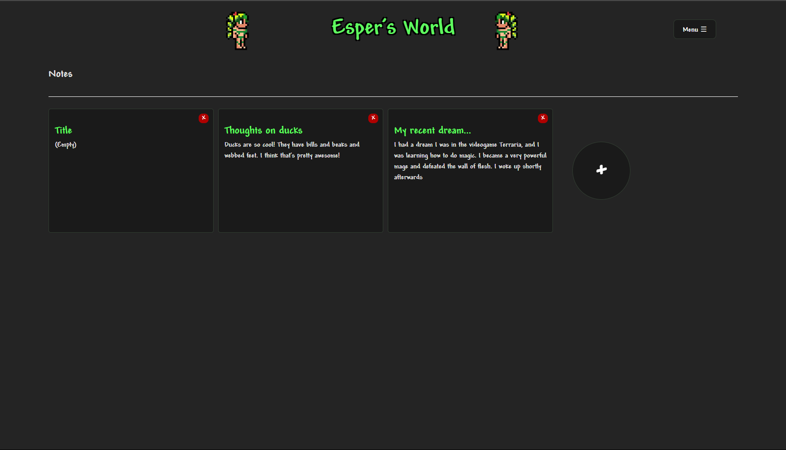

# Esper's World

## Overview

This project is a personal website for my client, designed with elements inspired by their favorite video games. The website functions as a note-making app, allowing users to create, edit, and delete personal notes with ease.

## Features

- **Note Creation**: Users can create personal notes to keep track of their thoughts, ideas, and tasks.
- **Edit Notes**: Notes can be easily edited, ensuring that users can update their information as needed.
- **Delete Notes**: Users have the option to delete notes that are no longer needed, helping them keep their notes organized.

### Technology Used For This Project

- VSCode
- React JS
- CSS
- HTML
- Git